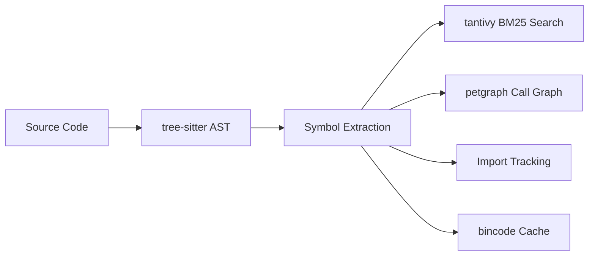

<div align="center">

# SymLens

**Give your AI agent a code search engine instead of `cat` or `grep`.**

[](https://crates.io/crates/symlens)
[](https://github.com/TtTRz/symlens/actions/workflows/ci.yml)
[](https://github.com/TtTRz/symlens/blob/main/LICENSE)
[](https://crates.io/crates/symlens)
[](https://www.rust-lang.org)
[](#-what-can-it-do)

[中文](./README_CN.md) | English

</div>

---

```bash
cargo install symlens           # install
symlens index                   # index your project
symlens search "AudioEngine"    # find symbols
symlens symbol "Engine::run"    # get just the signature → 60 tokens instead of 4000
```

SymLens parses your codebase with [tree-sitter](https://tree-sitter.github.io/) and builds an index of every symbol — functions, classes, call graphs, imports. Your AI agent (or you) queries exactly what it needs instead of reading entire files.

> **9 languages:** Rust · TypeScript · Python · Go · Swift · Dart · C · C++ · Kotlin

---

## Why not just `cat` and `grep`?

| | `cat` / `grep` | SymLens |
|:--|:--|:--|
| **Granularity** | Lines / files | Symbols (functions, classes, methods) |
| **Search** | Regex string matching | BM25 semantic search (camelCase / snake_case aware) |
| **Call graph** | — | Who calls whom · `callers` · `callees` · `graph path` |
| **Impact analysis** | — | `graph impact` — blast radius before you refactor |
| **Token cost** | ~4000 tokens (whole file) | ~60 tokens (signature only) — **66x cheaper** |
| **References** | Matches comments, strings, everything | AST-level — only real code references |

---

## 🔍 What Can It Do?

<table>
<tr><td width="50%">

**Search & Navigate**
```bash
symlens search "process audio"
symlens symbol "<id>" --source
symlens outline --project
symlens refs "Engine"
```

</td><td width="50%">

**Understand Call Flow**
```bash
symlens callers "process_block"
symlens callees "process_block"
symlens graph impact "Engine::run"
symlens graph path "main" "cleanup"
```

</td></tr>
<tr><td>

**Git-Aware**
```bash
symlens diff --from main --to HEAD
symlens blame "Engine::process_block"
```

</td><td>

**Tooling**
```bash
symlens doctor
symlens watch
symlens completions zsh
symlens init
```

</td></tr>
</table>

---

## ⚡ Performance

Benchmarked with [criterion](https://github.com/bheisler/criterion.rs) on the SymLens codebase (55 files, 660 symbols):

```
Full index ··········· 17 ms
BM25 search ·········· 89 µs
Callers query ········ 13 ns   ← cached DiGraph, no rebuild per query
Find call path ······· 20 µs   ← bidirectional BFS
Parse single file ···· 437 µs
```

---

## 🤖 MCP Server

Run as an [MCP](https://modelcontextprotocol.io/) server for Claude Code, Cursor, or any MCP-compatible editor:

```bash
cargo install symlens --features mcp
symlens mcp
```

<details>
<summary>MCP config (click to expand)</summary>

```json
{
  "mcpServers": {
    "symlens": { "command": "symlens", "args": ["mcp"] }
  }
}
```

**8 tools:** `index` · `search` · `symbol` · `outline` · `refs` · `impact` · `callers` · `callees`

</details>

---

## 🔌 Agent Setup

One command to teach your AI agent to use SymLens:

```bash
symlens setup claude-code                    # → CLAUDE.md
symlens setup cursor                         # → .cursor/rules/symlens.mdc
symlens setup openclaw                       # → ~/.openclaw/skills/symlens/SKILL.md
symlens setup --all                          # all agents at once
symlens setup --uninstall claude-code        # remove
```

---

## 🏗️ Architecture



Single binary · no runtime dependencies · index persists across sessions

---

## Limitations

- **Syntax-level analysis** (~90% precision). No type inference — for rename-refactoring or 99% accuracy, use an LSP.
- **Read-only.** SymLens doesn't modify code.
- C++ templates and Kotlin extension functions have limited call graph coverage.

## License

MIT

---

<sub>[Full command reference](./docs/commands.md) · [Changelog](./CHANGELOG.md)</sub>
