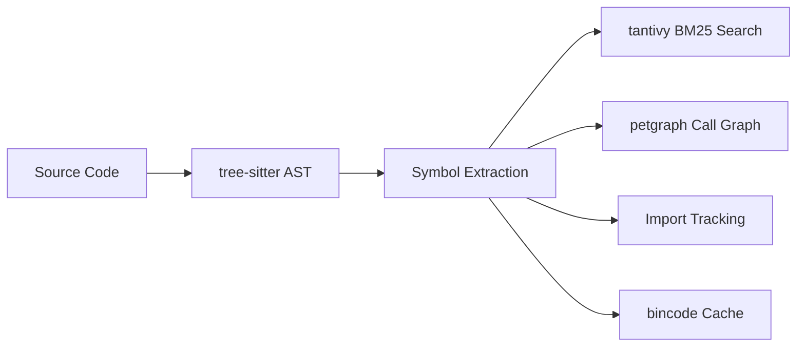

<div align="center">

# SymLens

**Give your AI agent a code search engine instead of `cat` or `grep`.**

[](https://crates.io/crates/symlens)
[](https://github.com/TtTRz/symlens/actions/workflows/ci.yml)
[](https://github.com/TtTRz/symlens/blob/main/LICENSE)
[](https://crates.io/crates/symlens)
[](https://www.rust-lang.org)
[](#-what-can-it-do)

[中文](./README_CN.md) | English

</div>

---

```bash
cargo install symlens           # install
symlens index                   # index your project
symlens search "AudioEngine"    # find symbols
symlens symbol "Engine::run"    # get just the signature → 60 tokens instead of 4000
```

SymLens parses your codebase with [tree-sitter](https://tree-sitter.github.io/) and builds an index of every symbol — functions, classes, call graphs, imports. Your AI agent (or you) queries exactly what it needs instead of reading entire files.

> **9 languages:** Rust · TypeScript · Python · Go · Swift · Dart · C · C++ · Kotlin

---

## Why not just `cat` and `grep`?

| | `cat` / `grep` | SymLens |
|:--|:--|:--|
| **Granularity** | Lines / files | Symbols (functions, classes, methods) |
| **Search** | Regex string matching | BM25 semantic search (camelCase / snake_case aware) |
| **Call graph** | — | Who calls whom · `callers` · `callees` · `graph path` |
| **Impact analysis** | — | `graph impact` — blast radius before you refactor |
| **Token cost** | ~4000 tokens (whole file) | ~60 tokens (signature only) — **66x cheaper** |
| **References** | Matches comments, strings, everything | AST-level — only real code references |

### Real-world comparison

Measured on the SymLens codebase itself (65 files, 672 symbols):

**Token efficiency** — how much context your agent consumes per query:

| Task | `cat` | `grep` | `symlens` | Saving |
|:--|--:|--:|--:|:--|
| Understand a file structure | 1,694 | — | **280** (`outline`) | **6x** fewer tokens |
| Find a symbol across project | — | 346 | **853** (`search`) | 2.5x more tokens, but includes type + signature + doc |
| Understand an entire project | 86,657 | — | **863** (`search`) | **100x** fewer tokens |

**Information quality** — what your agent gets back:

| | `grep` | `cat` | `symlens` |
|:--|:--:|:--:|:--:|
| Symbol kind (fn / struct / method) | — | — | Yes |
| Function signature | — | Must read function body | Directly provided |
| Doc comments | Unassociated | Must scroll up | Attached to symbol |
| Call relationships | — | — | `callers` / `callees` |
| File structure tree | — | — | `outline` |
| Cross-file navigation | Line number | — | Symbol ID + line range |

> **Key insight:** `grep` returns *matching lines*. `cat` returns *entire files*. SymLens returns *symbols with signatures and docs* — the exact granularity an AI agent needs to understand code without wasting context window.

---

## 🔍 What Can It Do?

<table>
<tr><td width="50%">

**Search & Navigate**
```bash
symlens search "process audio"
symlens symbol "<id>" --source
symlens outline --project
symlens refs "Engine"
```

</td><td width="50%">

**Understand Call Flow**
```bash
symlens callers "process_block"
symlens callees "process_block"
symlens graph impact "Engine::run"
symlens graph path "main" "cleanup"
symlens graph deps --fmt mermaid
```

</td></tr>
<tr><td>

**Git-Aware**
```bash
symlens diff --from main --to HEAD
symlens blame "Engine::process_block"
```

</td><td>

**Tooling**
```bash
symlens stats
symlens export --format json
symlens lines src/main.rs 10 25
symlens doctor
symlens watch
symlens completions zsh
symlens init
```

</td></tr>
</table>

---

## ⚡ Performance

Benchmarked with [criterion](https://github.com/bheisler/criterion.rs) on the SymLens codebase (55 files, 660 symbols):

```
Full index ··········· 17 ms
BM25 search ·········· 89 µs
Callers query ········ 13 ns   ← cached DiGraph, no rebuild per query
Find call path ······· 20 µs   ← bidirectional BFS
Parse single file ···· 437 µs
```

---

## 🤖 MCP Server

Run as an [MCP](https://modelcontextprotocol.io/) server for Claude Code, Cursor, or any MCP-compatible editor:

```bash
cargo install symlens --features mcp
symlens mcp
```

<details>
<summary>MCP config (click to expand)</summary>

```json
{
  "mcpServers": {
    "symlens": { "command": "symlens", "args": ["mcp"] }
  }
}
```

**10 tools:** `symlens_index` · `symlens_search` · `symlens_symbol` · `symlens_outline` · `symlens_refs` · `symlens_impact` · `symlens_callers` · `symlens_callees` · `symlens_lines` · `symlens_diff` · `symlens_stats`

</details>

---

## 🔌 Agent Setup

One command to teach your AI agent to use SymLens:

```bash
# Project-level (writes to project config)
symlens setup claude-code                    # → ./CLAUDE.md
symlens setup cursor                         # → .cursor/rules/symlens.mdc
symlens setup openclaw                       # → ~/.openclaw/skills/symlens/SKILL.md
symlens setup --all                          # all agents at once

# Global-level (available in all projects)
symlens setup claude-code --global           # → ~/.claude/skills/symlens/SKILL.md (use /symlens to activate)
symlens setup cursor --global                # → ~/.cursor/rules/symlens.mdc
symlens setup --all --global                 # all agents, user-level

# Uninstall
symlens setup --uninstall claude-code        # remove project-level
symlens setup --uninstall claude-code --global  # remove global skill
```

---

## 🏗️ Architecture



Single binary · no runtime dependencies · index persists across sessions

---

## 🌐 WASM Support

SymLens core (parsing, call graphs, symbol queries) can compile to WASM for browser-based usage:

```bash
cargo build --target wasm32-wasip1 --no-default-features --features wasm
```

<details>
<summary>WASM API (click to expand)</summary>

**7 functions** available via `wasm-bindgen`:

| Function | Description |
|----------|-------------|
| `parse_source(filename, source)` | Parse code → symbols JSON |
| `extract_calls(filename, source)` | Extract call edges |
| `extract_imports(filename, source)` | Extract imports |
| `build_call_graph(edges)` | Build graph from edges |
| `query_callers(graph, symbol)` | Query callers |
| `query_callees(graph, symbol)` | Query callees |
| `supported_extensions()` | List supported file types |

</details>

---

## Limitations

- **Syntax-level analysis** (~90% precision). No type inference — for rename-refactoring or 99% accuracy, use an LSP.
- **Read-only.** SymLens doesn't modify code.
- C++ templates and Kotlin extension functions have limited call graph coverage.

## License

MIT

---

<sub>[Full command reference](./docs/commands.md) · [Changelog](./CHANGELOG.md)</sub>
