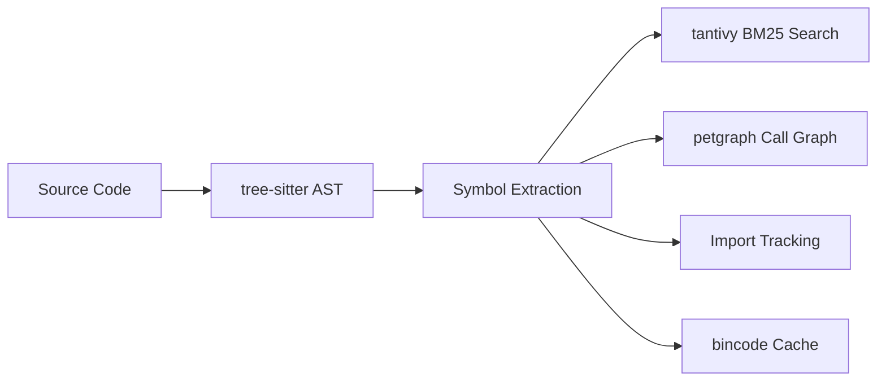

<div align="center">

# SymLens

**Give your AI agent a code search engine instead of `cat` or `grep`.**

[](https://crates.io/crates/symlens)
[](https://github.com/TtTRz/symlens/actions/workflows/ci.yml)
[](https://github.com/TtTRz/symlens/blob/main/LICENSE)
[](https://crates.io/crates/symlens)
[](https://www.rust-lang.org)
[](#-what-can-it-do)

[中文](./README_CN.md) | English

</div>

---

```bash
cargo install symlens           # install
symlens index                   # index your project
symlens search "AudioEngine"    # find symbols (fuzzy BM25)
symlens symbol "Engine::run"    # get just the signature → 60 tokens instead of 4000
symlens index --workspace       # index multiple projects as a workspace
symlens search "AudioEngien"    # fuzzy search — handles typos
```

SymLens parses your codebase with [tree-sitter](https://tree-sitter.github.io/) and builds an index of every symbol — functions, classes, call graphs, imports. Your AI agent (or you) queries exactly what it needs instead of reading entire files.

> **10 languages:** Rust · TypeScript · Python · Go · Swift · Dart · C · C++ · Kotlin · Vue

---

## Why not just `cat` and `grep`?

| | `cat` / `grep` | SymLens |
|:--|:--|:--|
| **Granularity** | Lines / files | Symbols (functions, classes, methods) |
| **Search** | Regex string matching | BM25 fuzzy search (camelCase / snake_case aware, typo-tolerant) |
| **Call graph** | — | Who calls whom · `callers` · `callees` · `graph path` |
| **Impact analysis** | — | `graph impact` — blast radius before you refactor |
| **Token cost** | ~4000 tokens (whole file) | ~60 tokens (signature only) — **66x cheaper** |
| **References** | Matches comments, strings, everything | AST-level — only real code references |

### Real-world comparison

Measured on the SymLens codebase itself (65 files, 672 symbols):

**Token efficiency** — how much context your agent consumes per query:

| Task | `cat` | `grep` | `symlens` | Saving |
|:--|--:|--:|--:|:--|
| Understand a file structure | 1,694 | — | **280** (`outline`) | **6x** fewer tokens |
| Find a symbol across project | — | 346 | **853** (`search`) | 2.5x more tokens, but includes type + signature + doc |
| Understand an entire project | 86,657 | — | **863** (`search`) | **100x** fewer tokens |

**Information quality** — what your agent gets back:

| | `grep` | `cat` | `symlens` |
|:--|:--:|:--:|:--:|
| Symbol kind (fn / struct / method) | — | — | Yes |
| Function signature | — | Must read function body | Directly provided |
| Doc comments | Unassociated | Must scroll up | Attached to symbol |
| Call relationships | — | — | `callers` / `callees` |
| File structure tree | — | — | `outline` |
| Cross-file navigation | Line number | — | Symbol ID + line range |

> **Key insight:** `grep` returns *matching lines*. `cat` returns *entire files*. SymLens returns *symbols with signatures and docs* — the exact granularity an AI agent needs to understand code without wasting context window.

---

## 🔍 What Can It Do?

<table>
<tr><td width="50%">

**Search & Navigate**
```bash
symlens search "process audio"
symlens symbol "<id>" --source
symlens outline --project
symlens refs "Engine"
symlens search "Engine" --workspace   # cross-project search
```

</td><td width="50%">

**Understand Call Flow**
```bash
symlens callers "process_block"
symlens callees "process_block"
symlens graph impact "Engine::run"
symlens graph path "main" "cleanup"
symlens graph deps --fmt mermaid
symlens graph deps --json         # includes cycle detection
symlens graph deps --module src/parser/mod.rs
symlens graph deps --module src/parser/mod.rs --reverse
```

</td></tr>
<tr><td>

**Git-Aware**
```bash
symlens diff --from main --to HEAD
symlens blame "Engine::process_block"
```

</td><td>

**Tooling**
```bash
symlens stats
symlens export --format json
symlens export --format sqlite
symlens lines src/main.rs 10 25
symlens doctor
symlens watch
symlens watch --serve            # daemon mode: keep index in memory
symlens --daemon search "Engine" # query via daemon (~6ms)
symlens completions zsh
symlens init
symlens search "handler" --offset 20 --limit 10  # pagination
symlens -v refs "Engine"        # verbose: timing & file counts
```

</td></tr>
</table>

---

## 📂 Workspace Mode

Index multiple project roots as a single workspace for cross-project symbol search, call graph traversal, and impact analysis.

```bash
# Create workspace config
cat > symlens.workspace.toml << 'EOF'
[workspace]
roots = ["../backend", "../frontend", "../shared"]
EOF

# Index the workspace
symlens index --workspace

# Cross-project search & call graph
symlens search "AuthService" --workspace
symlens callers "process_request" --workspace
symlens graph impact "UserModel" --workspace
```

**How it works:** Each root is indexed independently with its own cache, then merged into a unified `WorkspaceIndex`. Symbols are prefixed with the root's directory name for disambiguation (e.g., `[audio]src/main.rs::App#struct`). Per-root incremental indexing is preserved — only changed roots are re-indexed.

---

## ⚡ Performance

Benchmarked with [criterion](https://github.com/bheisler/criterion.rs) on the SymLens codebase (58 files, 828 symbols):

```
# Indexing
Full index ··········· 20 ms
Build call graph ····· 405 µs

# Search (in-memory, 828 symbols)
Exact name ··········· 149 µs
Partial name ········· 181 µs
Doc comment ·········· 181 µs
Miss (no results) ···· 191 µs

# Call graph queries (cached petgraph)
Callers ·············· 96 ns
Callees ·············· 28 ns
Transitive depth-3 ··· 1.08 µs
Find path ············ 577 µs
Impact analysis ······ 106 µs

# Parse single file
Rust ················· 521 µs
TypeScript ··········· 60 µs
Python ··············· 45 µs
Go ··················· 82 µs

# Dependency cycles (100-node graph)
has_cycle ············ 330 ns
detect_all_cycles ···· 261 µs

# Serialization
bincode encode ······· 182 µs
bincode decode ······· 728 µs
```

---

## 🚀 Daemon Mode

Keep the index in memory and serve queries via Unix socket — eliminates per-query index deserialization (~6ms vs ~10ms CLI).

```bash
# Start daemon (background)
symlens watch --serve &
# Listening on ~/.symlens/daemon/{hash}.sock

# All query commands work with --daemon flag
symlens --daemon search "Engine"
symlens --daemon refs "CallGraph"
symlens --daemon callers run
symlens --daemon graph impact run
```

**How it works:** `symlens watch --serve` loads the index once, watches for file changes, and accepts JSON-RPC queries over a Unix socket. `--daemon` routes CLI commands through the socket instead of loading from disk.

| Query | CLI | Daemon | vs rg |
|:------|:----|:-------|:------|
| search | 9.6ms | **6.2ms** (1.6×) | 1.1× faster |
| refs | 8.6ms | **6.2ms** (1.4×) | 1.0× |
| callers | 8.8ms | **6.2ms** (1.4×) | — |
| impact | 10.8ms | **7.0ms** (1.5×) | — |

No new dependencies — pure `std::thread` + `std::os::unix::net`.

---

## 🤖 MCP Server

Run as an [MCP](https://modelcontextprotocol.io/) server for Claude Code, Cursor, or any MCP-compatible editor:

```bash
cargo install symlens --features mcp
symlens mcp
```

<details>
<summary>MCP config (click to expand)</summary>

```json
{
  "mcpServers": {
    "symlens": { "command": "symlens", "args": ["mcp"] }
  }
}
```

**12 tools:** `symlens_index` · `symlens_index_workspace` · `symlens_search` · `symlens_symbol` · `symlens_outline` · `symlens_refs` · `symlens_impact` · `symlens_callers` · `symlens_callees` · `symlens_lines` · `symlens_diff` · `symlens_stats`

</details>

---

## Daemon vs MCP — When to use which?

Both keep the index in memory for fast queries, but serve different use cases:

| | Daemon | MCP |
|---|--------|-----|
| **Transport** | Unix socket (JSON-RPC) | stdio (rmcp protocol) |
| **Call from** | Terminal, scripts, CLI | AI agents (Claude Code, Cursor) |
| **Per-query overhead** | ~6ms (process + socket) | **<1ms** (in-process) |
| **Index refresh** | **Auto** (file watcher) | Manual (call `symlens_index`) |
| **Extra deps** | None | rmcp, schemars (`--features mcp`) |

**Use Daemon when:** you work in the terminal, write scripts, or need auto-reindex on file changes.

**Use MCP when:** an AI agent makes high-frequency queries and controls when to reindex.

Both can run simultaneously without conflict.

---

## 🔌 Agent Setup

One command to teach your AI agent to use SymLens:

```bash
# Project-level (writes to project config)
symlens setup claude-code                    # → ./CLAUDE.md
symlens setup codebuddy                      # → ./CODEBUDDY.md
symlens setup cursor                         # → .cursor/rules/symlens.mdc
symlens setup openclaw                       # → ~/.openclaw/skills/symlens/SKILL.md
symlens setup --all                          # all agents at once

# Global-level (available in all projects)
symlens setup claude-code --global           # → ~/.claude/skills/symlens/SKILL.md (use /symlens to activate)
symlens setup codebuddy --global             # → ~/.codebuddy/skills/symlens/SKILL.md + ~/.codebuddy/CODEBUDDY.md registration
symlens setup cursor --global                # → ~/.cursor/rules/symlens.mdc
symlens setup --all --global                 # all agents, user-level

# Uninstall
symlens setup --uninstall claude-code        # remove project-level
symlens setup --uninstall codebuddy          # remove project-level
symlens setup --uninstall claude-code --global  # remove global skill
symlens setup --uninstall codebuddy --global    # remove global skill + registration
```

---

## 🧭 Recommended Workflows

### Skill workflow (all agents)

Best for: Claude Code, Cursor, CodeBuddy, OpenClaw — works everywhere, zero setup beyond one command.

```bash
# 1. Install and index
symlens setup claude-code --global   # or cursor / codebuddy / openclaw / --all
symlens index

# 2. Use in your agent
# The agent reads the skill and calls symlens CLI directly:
#   symlens search "AuthService"
#   symlens refs "process_request"
#   symlens callers run
#   symlens graph impact "Engine::start"

# 3. After editing files, reindex
symlens index          # incremental, <1s

# 4. For faster queries during a session, start daemon in background
symlens watch --serve &
symlens --daemon search "Engine"   # ~6ms instead of ~10ms
```

### MCP workflow (Claude Code, Cursor)

Best for: agents that support MCP protocol — fastest queries, tightest integration.

```bash
# 1. Install with MCP support
cargo install symlens --features mcp

# 2. Add to MCP config
# Claude Code: ~/.claude/claude_desktop_config.json or project .mcp.json
# Cursor:      Settings → MCP → Add server
{
  "mcpServers": {
    "symlens": { "command": "symlens", "args": ["mcp"] }
  }
}

# 3. In agent conversation:
#   → symlens_index({ path: "/my/project" })     # index once
#   → symlens_search({ path: "/my/project", query: "AuthService" })
#   → symlens_refs({ path: "/my/project", name: "process_request" })
#   → symlens_callers({ path: "/my/project", name: "run" })
#   → symlens_impact({ path: "/my/project", name: "Engine::start" })
#
#   After editing files:
#   → symlens_index({ path: "/my/project" })     # incremental refresh
```

**Pro tip:** Combine both — use Skill for quick terminal queries, MCP for agent deep-dives.

---



SymLens respects [NO_COLOR](https://no-color.org/) and `CLICOLOR_FORCE` environment variables. Colors are automatically disabled when output is piped.

---

## 🌐 WASM Support

SymLens core (parsing, call graphs, symbol queries) can compile to WASM for browser-based usage:

```bash
cargo build --target wasm32-wasip1 --no-default-features --features wasm
```

<details>
<summary>WASM API (click to expand)</summary>

**7 functions** available via `wasm-bindgen`:

| Function | Description |
|----------|-------------|
| `parse_source(filename, source)` | Parse code → symbols JSON |
| `extract_calls(filename, source)` | Extract call edges |
| `extract_imports(filename, source)` | Extract imports |
| `build_call_graph(edges)` | Build graph from edges |
| `query_callers(graph, symbol)` | Query callers |
| `query_callees(graph, symbol)` | Query callees |
| `supported_extensions()` | List supported file types |

</details>

---

## Limitations

- **Syntax-level analysis** (~90% precision). No type inference — for rename-refactoring or 99% accuracy, use an LSP.
- **Read-only.** SymLens doesn't modify code.
- C++ templates and Kotlin extension functions have limited call graph coverage.

## License

MIT

---

<sub>[Full command reference](./docs/commands.md) · [Changelog](./CHANGELOG.md)</sub>
