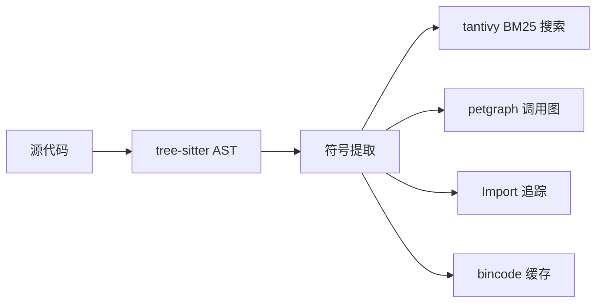

<div align="center">

# SymLens

**给你的 AI 代理一个代码搜索引擎，别再用 `cat` 或 `grep` 了。**

[](https://crates.io/crates/symlens)
[](https://github.com/TtTRz/symlens/actions/workflows/ci.yml)
[](https://github.com/TtTRz/symlens/blob/main/LICENSE)
[](https://crates.io/crates/symlens)
[](https://www.rust-lang.org)
[](#-能做什么)

中文 | [English](./README.md)

</div>

---

```bash
cargo install symlens           # 安装
symlens index                   # 索引项目
symlens search "AudioEngine"    # 搜索符号
symlens symbol "Engine::run"    # 获取签名 → 60 tokens，不再读 4000 tokens 的整个文件
```

SymLens 用 [tree-sitter](https://tree-sitter.github.io/) 解析代码库，建立全量符号索引——函数、类、调用图、import 关系。AI 代理（或你自己）按需精准查询，不再读整个文件。

> **9 种语言：** Rust · TypeScript · Python · Go · Swift · Dart · C · C++ · Kotlin

---

## 为什么不直接用 `cat` 和 `grep`？

| | `cat` / `grep` | SymLens |
|:--|:--|:--|
| **粒度** | 行 / 文件 | 符号（函数、类、方法） |
| **搜索** | 正则匹配字符串 | BM25 语义搜索（理解 camelCase / snake_case） |
| **调用关系** | — | 谁调用谁 · `callers` · `callees` · `graph path` |
| **影响分析** | — | `graph impact` — 重构前的爆炸半径 |
| **Token 开销** | ~4000 tokens（整个文件） | ~60 tokens（仅签名）— **便宜 66 倍** |
| **引用查找** | 匹配注释、字符串、所有东西 | AST 级别 — 只匹配真正的代码引用 |

---

## 🔍 能做什么？

<table>
<tr><td width="50%">

**搜索与导航**
```bash
symlens search "process audio"
symlens symbol "<id>" --source
symlens outline --project
symlens refs "Engine"
```

</td><td width="50%">

**理解调用流**
```bash
symlens callers "process_block"
symlens callees "process_block"
symlens graph impact "Engine::run"
symlens graph path "main" "cleanup"
symlens graph deps --fmt mermaid
```

</td></tr>
<tr><td>

**Git 感知**
```bash
symlens diff --from main --to HEAD
symlens blame "Engine::process_block"
```

</td><td>

**工具链**
```bash
symlens stats
symlens export --format json
symlens lines src/main.rs 10 25
symlens doctor
symlens watch
symlens completions zsh
symlens init
```

</td></tr>
</table>

---

## ⚡ 性能

使用 [criterion](https://github.com/bheisler/criterion.rs) 在 SymLens 自身代码库上实测（55 文件，660 符号）：

```
完整索引 ·········· 17 ms
BM25 搜索 ········· 89 µs
callers 查询 ······ 13 ns   ← 缓存 DiGraph，无需每次重建
调用路径查找 ······ 20 µs   ← 双向 BFS
解析单个文件 ······ 437 µs
```

---

## 🤖 MCP 服务器

作为 [MCP](https://modelcontextprotocol.io/) 服务器运行，集成到 Claude Code、Cursor 或任何 MCP 兼容编辑器：

```bash
cargo install symlens --features mcp
symlens mcp
```

<details>
<summary>MCP 配置（点击展开）</summary>

```json
{
  "mcpServers": {
    "symlens": { "command": "symlens", "args": ["mcp"] }
  }
}
```

**8 个工具：** `symlens_index` · `symlens_search` · `symlens_symbol` · `symlens_outline` · `symlens_refs` · `symlens_impact` · `symlens_callers` · `symlens_callees`

</details>

---

## 🔌 Agent 集成

一条命令让你的 AI 代理学会使用 SymLens：

```bash
# 项目级（写入项目配置）
symlens setup claude-code                    # → ./CLAUDE.md
symlens setup cursor                         # → .cursor/rules/symlens.mdc
symlens setup openclaw                       # → ~/.openclaw/skills/symlens/SKILL.md
symlens setup --all                          # 一键全部安装

# 全局级（所有项目可用）
symlens setup claude-code --global           # → ~/.claude/skills/symlens/SKILL.md（用 /symlens 激活）
symlens setup cursor --global                # → ~/.cursor/rules/symlens.mdc
symlens setup --all --global                 # 所有 agent，用户级

# 卸载
symlens setup --uninstall claude-code        # 移除项目级
symlens setup --uninstall claude-code --global  # 移除全局 skill
```

---

## 🏗️ 架构



单一二进制 · 无运行时依赖 · 索引跨会话持久化

---

## 🌐 WASM 支持

SymLens 核心（解析、调用图、符号查询）可编译为 WASM，用于浏览器环境：

```bash
cargo build --target wasm32-wasip1 --no-default-features --features wasm
```

<details>
<summary>WASM API（点击展开）</summary>

通过 `wasm-bindgen` 提供 **7 个函数**：

| 函数 | 描述 |
|------|------|
| `parse_source(filename, source)` | 解析代码 → 符号 JSON |
| `extract_calls(filename, source)` | 提取调用边 |
| `extract_imports(filename, source)` | 提取导入 |
| `build_call_graph(edges)` | 从边构建调用图 |
| `query_callers(graph, symbol)` | 查询调用者 |
| `query_callees(graph, symbol)` | 查询被调用者 |
| `supported_extensions()` | 列出支持的文件类型 |

</details>

---

## 局限

- **语法级分析**（~90% 精度）。没有类型推断——如果需要重命名重构或 99% 精度，请用 LSP。
- **只读。** SymLens 不修改代码。
- C++ 模板和 Kotlin 扩展函数的调用图覆盖有限。

## 许可证

MIT

---

<sub>[English](./README.md) · [完整命令参考](./docs/commands.md) · [Changelog](./CHANGELOG.md)</sub>
