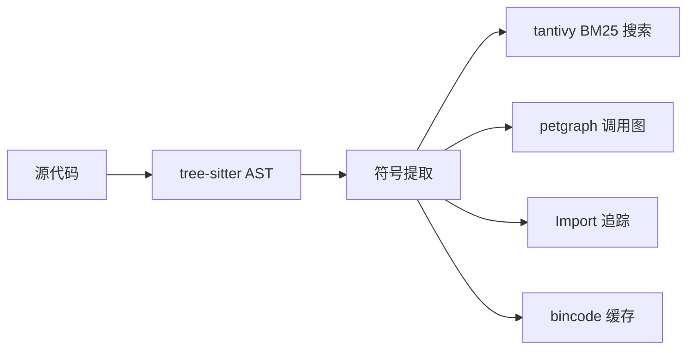

<div align="center">

# SymLens

**给你的 AI 代理一个代码搜索引擎，别再用 `cat` 或 `grep` 了。**

[](https://crates.io/crates/symlens)
[](https://github.com/TtTRz/symlens/actions/workflows/ci.yml)
[](https://github.com/TtTRz/symlens/blob/main/LICENSE)
[](https://crates.io/crates/symlens)
[](https://www.rust-lang.org)
[](#-能做什么)

中文 | [English](./README.md)

</div>

---

```bash
cargo install symlens           # 安装
symlens index                   # 索引项目
symlens search "AudioEngine"    # 搜索符号（模糊 BM25）
symlens symbol "Engine::run"    # 获取签名 → 60 tokens，不再读 4000 tokens 的整个文件
symlens index --workspace       # 多项目联合索引
symlens search "AudioEngien"    # 模糊搜索 — 容错拼写
```

SymLens 用 [tree-sitter](https://tree-sitter.github.io/) 解析代码库，建立全量符号索引——函数、类、调用图、import 关系。AI 代理（或你自己）按需精准查询，不再读整个文件。

> **10 种语言：** Rust · TypeScript · Python · Go · Swift · Dart · C · C++ · Kotlin · Vue

---

## 为什么不直接用 `cat` 和 `grep`？

| | `cat` / `grep` | SymLens |
|:--|:--|:--|
| **粒度** | 行 / 文件 | 符号（函数、类、方法） |
| **搜索** | 正则匹配字符串 | BM25 模糊搜索（理解 camelCase / snake_case，容错拼写） |
| **调用关系** | — | 谁调用谁 · `callers` · `callees` · `graph path` |
| **影响分析** | — | `graph impact` — 重构前的爆炸半径 |
| **Token 开销** | ~4000 tokens（整个文件） | ~60 tokens（仅签名）— **便宜 66 倍** |
| **引用查找** | 匹配注释、字符串、所有东西 | AST 级别 — 只匹配真正的代码引用 |

### 真实场景对比

基于 SymLens 自身代码库实测（65 个文件，672 个符号）：

**Token 效率** — 每次查询消耗多少上下文窗口：

| 任务 | `cat` | `grep` | `symlens` | 节省 |
|:--|--:|--:|--:|:--|
| 理解一个文件结构 | 1,694 | — | **280**（`outline`） | **6x** 更少 |
| 跨项目查找符号 | — | 346 | **853**（`search`） | 多 2.5x，但包含类型 + 签名 + 文档 |
| 理解整个项目 | 86,657 | — | **863**（`search`） | **100x** 更少 |

**信息质量** — AI agent 拿到什么：

| | `grep` | `cat` | `symlens` |
|:--|:--:|:--:|:--:|
| 符号类型（fn / struct / method） | — | — | 有 |
| 函数签名 | — | 需读整个函数体 | 直接提供 |
| 文档注释 | 无关联 | 需向上翻 | 关联到符号 |
| 调用关系 | — | — | `callers` / `callees` |
| 文件结构树 | — | — | `outline` |
| 跨文件定位 | 行号 | — | 符号 ID + 行范围 |

> **核心洞察：** `grep` 返回*匹配的行*。`cat` 返回*整个文件*。SymLens 返回*带签名和文档的符号*——恰好是 AI agent 理解代码所需的粒度，不浪费上下文窗口。

**大型 TypeScript 项目基准测试** — 真实编码任务：

| | baseline | symlens | 对比基线 |
|:--|--:|--:|:--|
| 通过率 | 79% | **100%** | +26.6% |
| 平均耗时 | 100% | 94.8% | -5.2% |
| Token 消耗 | 100% | 87.3% | -12.7% |
| Tool calls 次数 | 100% | 91.5% | -8.5% |

只对比都通过的用例：

| | baseline | symlens | 对比基线 |
|:--|--:|--:|:--|
| 平均耗时 | 100% | 84.1% | -15.9% |
| Token 消耗 | 100% | 88.6% | -11.4% |
| Tool calls 次数 | 100% | 87.6% | -12.4% |

> 执行环境：AI Agent 当中使用 subAgent 无提示词直接运行任务。
> - **baseline** = 无提示词
> - **symlens** = 使用 symlens 代码搜索

---

## 🔍 能做什么？

<table>
<tr><td width="50%">

**搜索与导航**
```bash
symlens search "process audio"
symlens symbol "<id>" --source
symlens outline --project
symlens refs "Engine"
symlens search "Engine" --workspace   # 跨项目搜索
```

</td><td width="50%">

**理解调用流**
```bash
symlens callers "process_block"
symlens callees "process_block"
symlens graph impact "Engine::run"
symlens graph path "main" "cleanup"
symlens graph deps --fmt mermaid
symlens graph deps --json         # 包含循环依赖检测
symlens graph deps --module src/parser/mod.rs
symlens graph deps --module src/parser/mod.rs --reverse
```

</td></tr>
<tr><td>

**Git 感知**
```bash
symlens diff --from main --to HEAD
symlens blame "Engine::process_block"
```

</td><td>

**工具链**
```bash
symlens stats
symlens export --format json
symlens export --format sqlite
symlens lines src/main.rs 10 25
symlens doctor
symlens watch
symlens watch --serve            # 守护进程模式：索引常驻内存
symlens --daemon search "Engine" # 通过守护进程查询 (~6ms)
symlens completions zsh
symlens init
symlens search "handler" --offset 20 --limit 10  # 分页
symlens -v refs "Engine"        # 详细模式：耗时 & 文件数
```

</td></tr>
</table>

---

## 📂 Workspace 模式

将多个项目根目录作为工作区统一索引，支持跨项目符号搜索、调用图遍历和影响分析。

```bash
# 创建 workspace 配置
cat > symlens.workspace.toml << 'EOF'
[workspace]
roots = ["../backend", "../frontend", "../shared"]
EOF

# 索引工作区
symlens index --workspace

# 跨项目搜索和调用图
symlens search "AuthService" --workspace
symlens callers "process_request" --workspace
symlens graph impact "UserModel" --workspace
```

**工作原理：** 每个 root 独立索引并拥有自己的缓存，然后合并到统一的 `WorkspaceIndex`。符号通过 root 目录名前缀消除歧义（如 `[audio]src/main.rs::App#struct`）。保留逐 root 增量索引——只有变更的 root 会重新索引。

---

## ⚡ 性能

使用 [criterion](https://github.com/bheisler/criterion.rs) 在 SymLens 自身代码库上实测（58 文件，828 符号）：

```
# 索引
完整索引 ·········· 20 ms
构建调用图 ········ 405 µs

# 搜索（内存，828 符号）
精确名称 ·········· 149 µs
部分名称 ·········· 181 µs
文档内容 ·········· 181 µs
未命中 ············ 191 µs

# 调用图查询（缓存 petgraph）
Callers ··········· 96 ns
Callees ··········· 28 ns
传递调用者 depth-3 · 1.08 µs
路径查找 ·········· 577 µs
影响分析 ·········· 106 µs

# 解析单文件
Rust ·············· 521 µs
TypeScript ········ 60 µs
Python ············ 45 µs
Go ················ 82 µs

# 依赖环检测（100 节点图）
单节点环检测 ······ 330 ns
全图环检测 ········ 261 µs

# 序列化
bincode 编码 ······ 182 µs
bincode 解码 ······ 728 µs
```

---

## 🚀 守护进程模式

将索引常驻内存，通过 Unix socket 响应查询 — 消除每次查询的索引反序列化开销 (~6ms vs CLI ~10ms)。

```bash
# 启动守护进程（后台运行）
symlens watch --serve &
# 监听 ~/.symlens/daemon/{hash}.sock

# 所有查询命令支持 --daemon 标志
symlens --daemon search "Engine"
symlens --daemon refs "CallGraph"
symlens --daemon callers run
symlens --daemon graph impact run
```

**工作原理：** `symlens watch --serve` 加载一次索引，监听文件变更，通过 Unix socket 接收 JSON-RPC 查询。`--daemon` 将 CLI 命令路由到 socket 而非从磁盘加载。

| 查询 | CLI | Daemon | vs rg |
|:-----|:----|:-------|:------|
| search | 9.6ms | **6.2ms** (1.6×) | 1.1× faster |
| refs | 8.6ms | **6.2ms** (1.4×) | 1.0× |
| callers | 8.8ms | **6.2ms** (1.4×) | — |
| impact | 10.8ms | **7.0ms** (1.5×) | — |

无额外依赖 — 纯 `std::thread` + `std::os::unix::net`。

---

## 🤖 MCP 服务器

作为 [MCP](https://modelcontextprotocol.io/) 服务器运行，集成到 Claude Code、Cursor 或任何 MCP 兼容编辑器：

```bash
cargo install symlens --features mcp
symlens mcp
```

<details>
<summary>MCP 配置（点击展开）</summary>

```json
{
  "mcpServers": {
    "symlens": { "command": "symlens", "args": ["mcp"] }
  }
}
```

**12 个工具：** `symlens_index` · `symlens_index_workspace` · `symlens_search` · `symlens_symbol` · `symlens_outline` · `symlens_refs` · `symlens_impact` · `symlens_callers` · `symlens_callees` · `symlens_lines` · `symlens_diff` · `symlens_stats`

</details>

---

## Daemon vs MCP — 怎么选？

两者都把索引常驻内存以加速查询，但适用场景不同：

| | Daemon | MCP |
|---|--------|-----|
| **传输方式** | Unix socket (JSON-RPC) | stdio (rmcp 协议) |
| **调用方** | 终端、脚本、CLI | AI agent（Claude Code、Cursor） |
| **每次查询开销** | ~6ms（进程启动 + socket） | **<1ms**（进程内调用） |
| **索引刷新** | **自动**（文件监听） | 手动（调用 `symlens_index`） |
| **额外依赖** | 无 | rmcp、schemars（`--features mcp`） |

**用 Daemon：** 在终端工作、写脚本、或需要文件改动自动 reindex。

**用 MCP：** AI agent 高频查询，agent 自己控制何时 reindex。

两者可以同时运行，互不干扰。

---

## 🔌 Agent 集成

一条命令让你的 AI 代理学会使用 SymLens：

```bash
# 项目级（写入项目配置）
symlens setup claude-code                    # → ./CLAUDE.md
symlens setup codebuddy                      # → ./CODEBUDDY.md
symlens setup cursor                         # → .cursor/rules/symlens.mdc
symlens setup openclaw                       # → ~/.openclaw/skills/symlens/SKILL.md
symlens setup --all                          # 一键全部安装

# 全局级（所有项目可用）
symlens setup claude-code --global           # → ~/.claude/skills/symlens/SKILL.md（用 /symlens 激活）
symlens setup codebuddy --global             # → ~/.codebuddy/skills/symlens/SKILL.md + ~/.codebuddy/CODEBUDDY.md 注册
symlens setup cursor --global                # → ~/.cursor/rules/symlens.mdc
symlens setup --all --global                 # 所有 agent，用户级

# 卸载
symlens setup --uninstall claude-code        # 移除项目级
symlens setup --uninstall codebuddy          # 移除项目级
symlens setup --uninstall claude-code --global  # 移除全局 skill
symlens setup --uninstall codebuddy --global    # 移除全局 skill + 注册
```

---

## 🧭 推荐工作流

### Skill 工作流（所有 agent）

适合：Claude Code、Cursor、CodeBuddy、OpenClaw — 通用方案，一条命令即可。

```bash
# 1. 安装并索引
symlens setup claude-code --global   # 或 cursor / codebuddy / openclaw / --all
symlens index

# 2. 在 agent 中使用
# Agent 读取 skill 后直接调用 symlens CLI：
#   symlens search "AuthService"
#   symlens refs "process_request"
#   symlens callers run
#   symlens graph impact "Engine::start"

# 3. 编辑文件后，重新索引
symlens index          # 增量索引，<1s

# 4. 需要更快查询时，后台启动 daemon
symlens watch --serve &
symlens --daemon search "Engine"   # ~6ms，替代 ~10ms
```

### MCP 工作流（Claude Code、Cursor）

适合：支持 MCP 协议的 agent — 最快查询，最紧密集成。

```bash
# 1. 安装 MCP 版本
cargo install symlens --features mcp

# 2. 添加到 MCP 配置
# Claude Code: ~/.claude/claude_desktop_config.json 或项目 .mcp.json
# Cursor:      Settings → MCP → Add server
{
  "mcpServers": {
    "symlens": { "command": "symlens", "args": ["mcp"] }
  }
}

# 3. 在 agent 对话中：
#   → symlens_index({ path: "/my/project" })     # 建一次索引
#   → symlens_search({ path: "/my/project", query: "AuthService" })
#   → symlens_refs({ path: "/my/project", name: "process_request" })
#   → symlens_callers({ path: "/my/project", name: "run" })
#   → symlens_impact({ path: "/my/project", name: "Engine::start" })
#
#   编辑文件后：
#   → symlens_index({ path: "/my/project" })     # 增量刷新
```

**进阶技巧：** 两者结合 — Skill 用于终端快速查询，MCP 用于 agent 深度分析。

---



SymLens 遵循 [NO_COLOR](https://no-color.org/) 和 `CLICOLOR_FORCE` 环境变量。管道输出时自动禁用颜色。

---

## 🌐 WASM 支持

SymLens 核心（解析、调用图、符号查询）可编译为 WASM，用于浏览器环境：

```bash
cargo build --target wasm32-wasip1 --no-default-features --features wasm
```

<details>
<summary>WASM API（点击展开）</summary>

通过 `wasm-bindgen` 提供 **7 个函数**：

| 函数 | 描述 |
|------|------|
| `parse_source(filename, source)` | 解析代码 → 符号 JSON |
| `extract_calls(filename, source)` | 提取调用边 |
| `extract_imports(filename, source)` | 提取导入 |
| `build_call_graph(edges)` | 从边构建调用图 |
| `query_callers(graph, symbol)` | 查询调用者 |
| `query_callees(graph, symbol)` | 查询被调用者 |
| `supported_extensions()` | 列出支持的文件类型 |

</details>

---

## 局限

- **语法级分析**（~90% 精度）。没有类型推断——如果需要重命名重构或 99% 精度，请用 LSP。
- **只读。** SymLens 不修改代码。
- C++ 模板和 Kotlin 扩展函数的调用图覆盖有限。

## 许可证

MIT

---

<sub>[English](./README.md) · [完整命令参考](./docs/commands.md) · [Changelog](./CHANGELOG.md)</sub>
